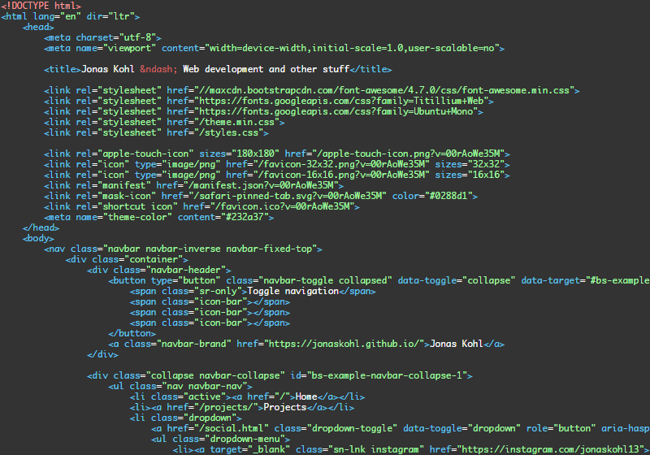
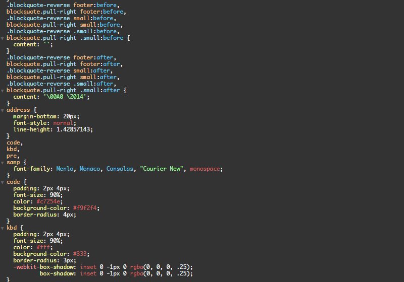

# Agate theme for Brackets
Agate Theme for Brackets <[http://brackets.io/](http://brackets.io/)>, based on the Agate theme for highlight.js <[http://highlightjs.org/](http://highlightjs.org/)> by Taufik Nurrohman <[@tovic](https://github.com/tovic)>

## Installation
Go to the Brackets Extension Manager, go to the _Themes_ tab and search for _Agate Theme_. Click install.  
Click _View_ > _Themes..._ and select _Agate Theme_ from the _Current Theme_ dropdown.
 
## Screenshots

 

